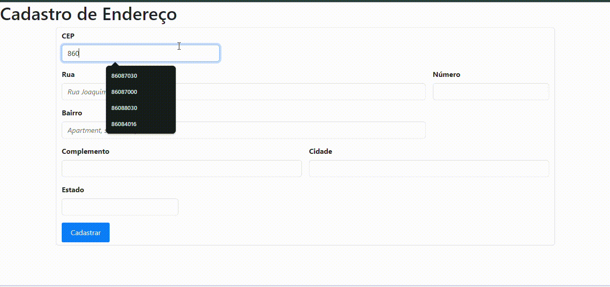

# form-CadEndereco

* [introdoção](#introducao)
* [funcionalidades](#funcionalidades)
* [Funções](#funções)
* [Referências](#referências)
* [Tecnologias utilizadas](#tecnologias-utilizadas)
* [Autores](#autores)

## Introdução
Esse projeto consiste em uma pagina web de procura de endereço utilizando uma ferramenta de busca de C.E.P , onde ao ser digitado no campo, adiciona as informações automaticamente aos campos corretos.

## ViaCep
* 
O ViaCEP é uma API (Interface de Programação de Aplicações) brasileira que disponibiliza informações detalhadas sobre endereços a partir de seus CEPs (Códigos de Endereçamento Postal). Essa ferramenta gratuita e simples de usar tem se tornado indispensável para diversas aplicações que exigem a localização precisa de endereços, como:

- E-commerce: Calcular frete, validar endereços e otimizar a entrega;
- Sistemas de gestão: Cadastrar clientes, fornecedores e realizar entregas;
- Aplicativos de delivery: Localizar estabelecimentos e clientes;
- Mapas e geolocalização: Integrar dados de endereços em mapas;
E muito mais.

Como funciona?

1- Faça uma requisição: Envie uma requisição HTTP para a API ViaCEP, informando o CEP desejado.
2- Receba os dados: A API retorna um JSON com as informações do endereço, como logradouro, bairro, cidade estado e outros detalhes.
3- Utilize os dados: Integre os dados recebidos em sua aplicação para as finalidades desejadas.

Vantagens de utilizar o ViaCEP:

- Gratuito: Não há custos para utilizar a API.
- Simples: A documentação é clara e fácil de entender.
- Completo: Fornece informações detalhadas sobre os endereços.
- Confiável: A base de dados é constantemente atualizada.
- Versátil: Pode ser integrada a diversas linguagens de programação e plataformas.

## Site
Chegando ao site o usuario deve inserir algum CEP (Codigo de Endereçamento Postal), se o CEP for existente, ao sair do campo de digitação as informações da localização irão aparecer nos devidos lugares. Caso o CEP for inexistente uma mensagem irá aparecer na tela dizendo que o mesmo não foi encontrado.

## Funcionalidades

O código JavaScript fornecido tem como objetivo principal consumir a API do ViaCEP para buscar informações de endereços a partir de um CEP (Código de Endereçamento Postal) digitado pelo usuário em um formulário HTML. A seguir, uma explicação detalhada de cada parte do código:

O código inteiro é feito no modo restrito onde o mesmo ajuda a evitar erros comuns e garante um código mais seguro. Nesse modo, variáveis precisam ser declaradas antes de serem usadas, e algumas palavras-chave reservadas não podem ser utilizadas como nomes de variáveis.

No código existe as seguintes funções:

- Função limparFormulario();
- Função eNumero();
- Função cepValido();
- Função preencherFormulario();
- Função pesquisarCep();
- Método fetch();
- Focusout;
e outras expressões regulares que serão explicadas na parte das funções.

Resumo da Funcionalidade:

1- O usuário digita um CEP no campo correspondente.
2- Ao sair do campo (evento focusout), a função pesquisarCep() é acionada.
3- A função valida o CEP e realiza uma requisição à API do ViaCEP.
4- Se o CEP for válido e encontrado, as informações do endereço são preenchidas automaticamente nos demais campos do formulário.
5- Caso contrário, uma mensagem de erro é exibida.

Em resumo, o código automatiza o processo de consulta de endereços por CEP, proporcionando uma experiência mais rápida e conveniente para o usuário.

## Funções
Para todos que não sabem a função (const) define uma constante, ou seja, uma variável cujo valor não pode ser alterado após sua inicialização.

Console.log - O console.log é uma função do JavaScript que imprime uma mensagem no console do navegador ou do ambiente de desenvolvimento.

* enumero:

A função eNumero verifica se a string passada como argumento é composta apenas por dígitos numéricos, do 0 ao 9. Se for, a função retorna true; caso contrário, retorna false. 

^[0-9]+$: Essa é uma expressão regular (regex). Ela define um padrão que queremos encontrar na string.
^: Indica o início da string.

[0-9]+: Significa que queremos encontrar um ou mais caracteres que estejam no intervalo de 0 a 9.
$: Indica o final da string.

.test(numero): Esse método é aplicado à expressão regular e recebe a string numero como argumento. Ele retorna true se a string corresponder inteiramente ao padrão definido pela regex, ou false caso contrário.

* cepValido:

Essa linha define uma função em JavaScript chamada cepValido. Essa função tem como objetivo verificar se um determinado CEP (Código de Endereçamento Postal) brasileiro é válido.

=>: É a sintaxe da arrow function (função de seta) em JavaScript, uma forma mais concisa de escrever funções.

cep.length == 8: Verifica se o comprimento da string cep é igual a 8. Um CEP brasileiro válido possui exatamente 8 dígitos.

&&: É o operador lógico "e". Significa que ambas as condições à esquerda e à direita do operador devem ser verdadeiras para que o resultado final seja verdadeiro.

* preencherFormulario:

Em resumo:

A função preencherFormulario recebe um objeto com as informações de um endereço e preenche automaticamente os campos de um formulário HTML com esses dados. Essa função é muito útil para criar formulários dinâmicos que se preenchem automaticamente a partir de uma API de consulta de endereços, como a ViaCEP no Brasil.

* pesquisarCep:
Essa função JavaScript, chamada pesquisarCep, tem a função de buscar informações sobre um CEP utilizando a API do ViaCEP e, em seguida, preencher automaticamente um formulário HTML com os dados encontrados.

async: Indica que a função é assíncrona, ou seja, ela pode realizar operações que levam tempo, como fazer uma requisição a uma API, sem bloquear a execução do código.

* limparFormulario();:

Chama uma função (não mostrada no código) chamada limparFormulario que provavelmente limpa os campos do formulário antes de realizar uma nova pesquisa, evitando que dados antigos permaneçam.

const dados = await fetch(url);:
Faz uma requisição à API utilizando a função fetch. O resultado da requisição é armazenado na constante dados. O await faz com que a função aguarde a resposta da API antes de continuar.

const addres = await dados.json();:
Converte a resposta da API, que está em formato JSON, para um objeto JavaScript e armazena esse objeto na constante addres.

if(addres.hasOwnProperty('erro')){ ... }:
Verifica se o objeto addres possui uma propriedade chamada "erro". Se sim, significa que o CEP não foi encontrado e exibe uma mensagem de erro.

preencherFormulario(addres):
Chama a função preencherFormulario (que você também já foi explicado) para preencher o formulário com os dados do endereço retornados pela API.

Em resumo:

A função pesquisarCep realiza os seguintes passos:

Limpa o formulário.
Verifica se o CEP é válido.
Faz uma requisição à API do ViaCEP.
Converte a resposta da API para um objeto JavaScript.
Verifica se houve algum erro na consulta.
Preenche o formulário com os dados do endereço, caso a consulta seja bem-sucedida.

* document.getElementById('cep').addEventListener('focusout', pesquisarCep);

Esse código configura o campo de entrada do CEP para que, assim que o usuário terminar de digitar e clicar fora do campo, a função pesquisarCep seja automaticamente chamada. Isso é útil para realizar uma pesquisa de CEP em tempo real, à medida que o usuário digita.

.addEventListener: É um método que adiciona um listener de eventos ao elemento selecionado.

'focusout': Especifica o tipo de evento que estamos monitorando. Nesse caso, é o evento focusout, que ocorre quando o foco do usuário sai do elemento.

## Referências

[Mdn](https://developer.mozilla.org/pt-BR/)
[Alura](https://www.alura.com.br)

## Tecnologias Utilizadas
* [<code></code>](https://developer.mozilla.org/pt-BR/docs/Web/HTML)
* [<code></code>](https://git-scm.com/)
* [<code></code>](https://code.visualstudio.com/)
* [<code></code>](https://github.com/)
* [<code></code>](https://developer.mozilla.org/pt-BR/docs/Web/JavaScript)
* [<code></code>](https://developer.mozilla.org/pt-BR/docs/Web/CSS)
## Autores
* ``Aluno 2ºC:``Rafael Souza Mastellini